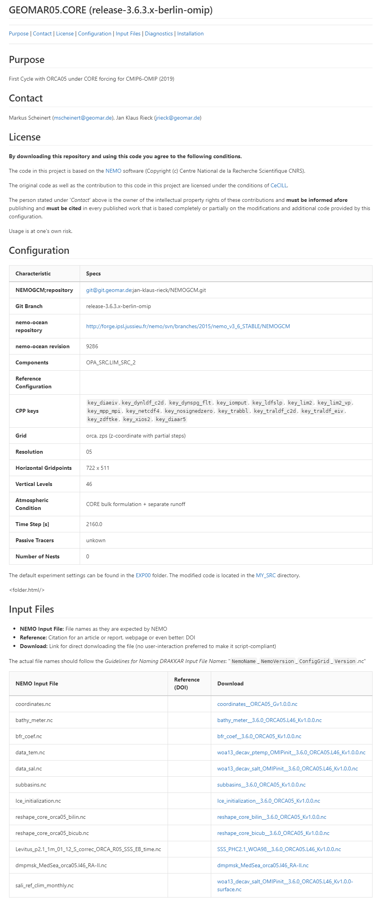

# Create the README file with **mkReadme**

**mkReadme** helps you creating a README file that summerizes the characteristics of a simulation (an experiment with a specific configuration) as Markdown file (*README.md*).

## Step-by-Step

Go into your experiment folder.

!!! tip "Experiment Folder"
    Please, be aware, that currently mkReadme expects you to be wihtin the NEMO repository tree.
    If your **experiment folder** is outside of e.g. `NEMO/cfgs/WhateverConfig/YourEXP`, please consider
    copying the necessear files (no need to copy the huge input data files, `input.ini` will be sufficient).
​    

## Example

> 